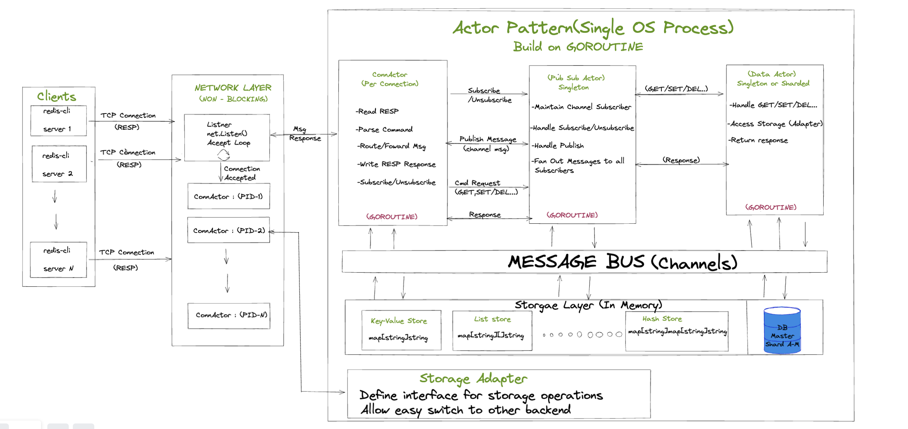
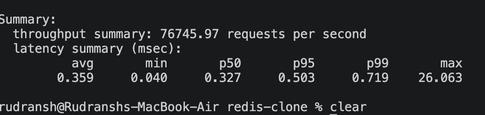
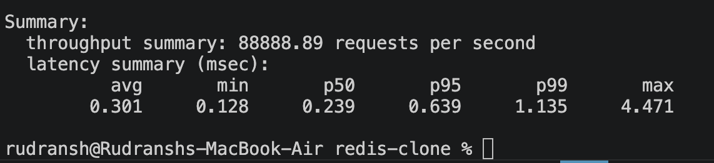
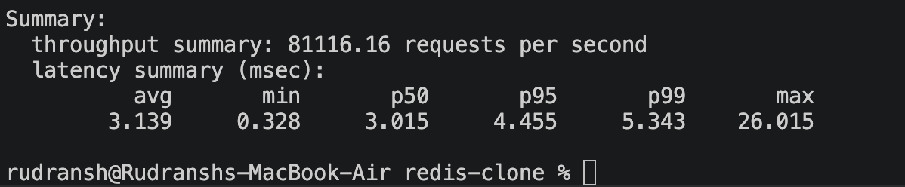
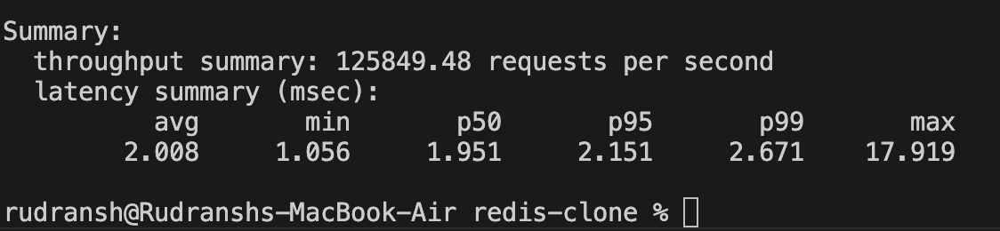

# Go Redis

### An Actor-Based Redis Built in Go

> Exploring what Redis would look like if it were built around the Actor Model, Goroutines, and Message Passing instead of shared-memory concurrency.

---

## Architecture

<p align="center">
  
</p>

---

## Overview

GoDis is a Redis-inspired in-memory datastore built from scratch in Go.

Instead of relying on mutexes and shared state, GoDis uses the **Actor Pattern**, where every component owns its state and communicates through message passing.

The goal of this project was not to replace Redis, but to deeply understand:

* Distributed Systems
* In-Memory Databases
* Actor-Based Architectures
* Concurrency Models
* RESP Protocol
* Cache Eviction Strategies
* Pub/Sub Systems
* Performance Engineering

---

## Why Build Redis with Actors?

Traditional Redis follows a single-threaded event-loop architecture.

GoDis explores a different approach:

```text
Client
   ↓
ConnActor
   ↓
StorageActor / PubSubActor
   ↓
Response
```

Every subsystem is represented as an Actor:

* Own state
* Own mailbox
* Own goroutine
* Sequential message processing

This eliminates the need for shared-state locking.

---

## Core Features

### Networking

* TCP Server
* RESP Protocol Support
* Redis CLI Compatible

Supported clients:

* redis-cli
* redis-benchmark
* Custom TCP clients

---

### Actor Runtime

Every actor consists of:

```text
1 Goroutine
+
1 Mailbox
+
Owned State
```

Communication:

```go
pid.Tell(message)
```

instead of:

```go
sync.Mutex
```

---

### Data Structures

#### Strings

```redis
SET key value
GET key
DEL key
```

---

#### Lists

```redis
LPUSH
RPUSH
LPOP
RPOP
LLEN
```

---

#### Hashes

```redis
HSET
HGET
HDEL
```

---

### Pub/Sub

```redis
SUBSCRIBE news

PUBLISH news hello
```

Implemented through a dedicated PubSubActor.

Flow:

```text
Publisher
    ↓
PubSubActor
    ↓
Subscriber ConnActors
```

---

### TTL Expiration

Supported:

```redis
EXPIRE
TTL
PERSIST
```

Architecture:

```text
TimerActor
     ↓
ExpireMsg
     ↓
StorageActor
```

No background thread directly mutates storage.

Everything is message-driven.

---

### Approximate LRU Eviction

Inspired by Redis's production implementation.

Instead of maintaining a true LRU linked list:

```text
O(log n)
```

Go Redis uses:

```text
Candidate Pool
```

Algorithm:

1. Randomly sample keys
2. Track oldest candidates
3. Maintain eviction pool
4. Evict best victim

This closely mirrors Redis's Approximate LRU approach.

---

## System Design

### ConnActor

One actor per TCP connection.

Responsibilities:

* Read RESP
* Parse Commands
* Route Requests
* Write RESP Responses
* Handle Subscriptions

---

### StorageActor

Owns all datastore state.

Responsibilities:

* GET
* SET
* DEL
* Hash Operations
* List Operations
* TTL Management
* Eviction

No locks.

No shared state.

---

### PubSubActor

Owns:

```go
map[channel][]subscriber
```

Responsibilities:

* Subscribe
* Unsubscribe
* Publish
* Fan-Out Delivery

---

### TimerActor

Responsible for:

* Active Expiration
* Lazy Expiration
* Periodic Cleanup

---

### Lightweight Deployment Model

It runs as a single Go binary.

Benefits:

Simple deployment
Minimal runtime dependencies
Lower operational overhead
Easier edge deployment

For smaller teams, this can reduce infrastructure management complexity.

## Design Principles

### Lock-Free Storage Access

Instead of:

```text
Thread
   ↓
Mutex
   ↓
Shared Map
```

Go Redis uses:

```text
Actor
   ↓
Mailbox
   ↓
Owned State
```

Benefits:

* No lock contention
* No race conditions
* Easier reasoning
* Sequential state transitions

---

### Message Passing

All inter-component communication happens through channels.

```text
Actor A
   ↓
Message
   ↓
Actor B
```

No actor directly touches another actor's state.

---

### Storage Adapter Pattern

Storage logic is abstracted behind adapters.

```go
type StorageAdapter interface {
    Get(...)
    Set(...)
    Delete(...)
}
```

Benefits:

* Backend flexibility
* Easier testing
* Cleaner architecture

---

# Performance Benchmarks

Benchmarks executed using:

```bash
redis-benchmark
```

Machine:

* Apple Silicon MacBook Air
* Go 1.24+

---

## Benchmark Summary

| Test              | GoDis          | Redis           |
| ----------------- | -------------- | --------------- |
| SET (50 Clients)  | 95,510 ops/sec | 121,506 ops/sec |
| GET (50 Clients)  | 76,745 ops/sec | 88,888 ops/sec  |
| SET (500 Clients) | 82,836 ops/sec | 128,139 ops/sec |
| GET (500 Clients) | 81,116 ops/sec | 125,849 ops/sec |

---

## 50 Concurrent Clients

### Go Redis

<p align="center">
  
</p>

### Redis

<p align="center">
  
</p>

---

## 500 Concurrent Clients

### Go Redis

<p align="center">
  
</p>

### Redis

<p align="center">
  
</p>

---

## Key Observation

The benchmark exposed the primary bottleneck:

```text
500 Clients
      ↓
500 ConnActors
      ↓
Single StorageActor
      ↓
Single Mailbox
```

The storage actor becomes the serialization point.

This means throughput eventually becomes constrained by a single actor's mailbox processing capacity.

---

## Future Work

### Storage Sharding

Current:

```text
1 StorageActor
```

Planned:

```text
RouterActor
      ↓
 ┌────┼────┐
 ▼    ▼    ▼

S0   S1   S2 ... SN
```

Routing:

```go
hash(key) % N
```

Benefits:

* Parallel keyspaces
* Reduced contention
* Horizontal scaling

---


### Raft-Based Coordination

Planned:

* Leader Election
* Log Replication
* Fault Tolerance

---

## What I discovered

One of the most interesting discoveries was seeing how far an actor-based architecture can scale before mailbox contention becomes the dominant bottleneck.

---

## Run

Clone:

```bash
git clone https://github.com/<your-username>/redis-clone.git

cd redis-clone
```

Run:

```bash
go run main.go
```

Server:

```text
localhost:6379
```

Test:

```bash
redis-cli -p 6379
```

---

## Author

**Rudransh Srivastava**

